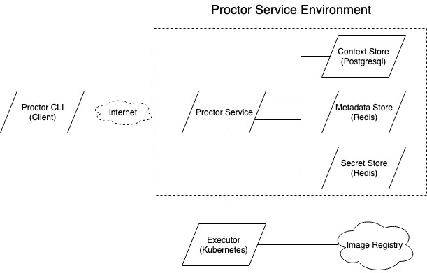

# Proctor

<p align="center"></p>
<p align="center">
  <a href="https://travis-ci.org/gojek/proctor"></img></a>
  <a href="https://goreportcard.com/report/github.com/gojek/proctor"></img></a>
  <a href="https://golangci.com"></img></a>
</p>

## Description
Proctor is a set of components that allow user to do automated task with configurable access policy.
Bundle repetitive task as a automation and turn it into `procs` to make it easier for user to do it themself.

Before we goes deep down into explanation about proctor, you may want to read about [Proctor Glossary](docs/glossary.md)

## Feature list
Section for full features list of proctor CLI is separated [here](./docs/features.md)

## Installation
This section provide installation for unix environment.

General step

* Install and setup golang
* Clone this repository
* Run `make build`. This will generate binary for proctor cli and service

For proctor service

* Make sure you have running Redis server
* Make sure you have running Postgres server
* Make sure you have running Kubernetes Cluster, for setting up local cluster, please refer [here](https://kubernetes.io/docs/setup/learning-environment/minikube/)
* Copy `.env.sample` into `.env` file. Please refer [here](#proctor-service-configuration-explanation) for configuration explanation
* Make sure you set correct value in `.env` for Kubernetes, Postgresql, and Redis
* Export value of `.env` by running `source .env`
* Run `make db.setup` to setup local postgresql and migration
* Run `./_output/bin/server s` to start proctor service

For proctor cli

* Run `./_output/bin/cli config PROCTOR_HOST=<proctor-service-host>` to point you proctor cli to local proctor service
* Run `./_output/bin/cli` to see complete usage of proctor cli
* Run `make ftest.update.metadata` to generate sample available command
* Test the client with `./_output/bin/cli list`

## Proctor Components
Here's the overview of proctor components.


#### Proctor CLI
Proctor cli is a command line interface that used by client to interact with Proctor service.
Proctor cli read user configuration such as Proctor service host, user email, and user token from `~/.proctor/proctor.yaml`.

#### Proctor Service
Proctor service govern the main process of Proctor such as:
  * Create execution context
  * Create and read procs metadata
  * Create and read procs secret
  * Order the execution of procs
  * Get execution status and log of running procs

#### Context Store
Currently Proctor service use postgres to store execution context of procs.

#### Metadata Store
Metadata store contain all procs metadata, procs that doesn't have metadata on store cannot be executed.

#### Secret Store
Secret store contain secret value that needed by procs to executed.

#### Executor
Executor is the one that executing the procs, we use Kubernetes Job as executor.
Proctor service will send the procs name, needed args then executor will pull necessary image to run the procs.
Proctor service will occasionally contact executor to get status of requested procs.

## Procs Execution Flow
Here's what happen between Proctor components when client want to execute a procs.
  1. Cli send execution request to service. This request consist of procs name, procs args, and user credentials.
  2. Service get metadata and secret for requested procs.
  3. Service create execution context to store data related to procs execution.
  4. Service tell the executor to run the procs image along with user argument and procs secret.
  5. Service watch the process run by executor by getting the log and execution status then write it to execution context.

## Security flow
Some route is protected by authentication, authorization or both.
Authenticated user means that user should have account related with proctor.
Authorized user means that user should be part of groups that defined on procs meatadata, for example when procs authorized groups is `proctor-user`, and `dev` then user need to be a member of both groups.

A request need head these headers to pass auth process:
```
'Access-Token: <user-access-token>'
'Email-Id: <user-email>'
```

List of routes that require authentication:
 - POST /execution
 - GET /execution/{contextId}/status
 - GET /execution/logs
 - GET /metadata
 - POST /metadata
 - POST /secret
 - POST /schedule
 - GET /schedule
 - GET /schedule/{scheduleID}
 - DELETE /schedule/{scheduleID}
 
List of routes that require authorization:
 - POST /execution
 - POST /schedule

Proctor doesn't come with built in auth implementation, it's using configurable [plugin](#plugin) mechanism.

## Plugin

Proctor service use plugin for:
  1. Authentication
  2. Authorization
  3. Notification

It create limitation that proctor service can only be used on Linux and MacOS (Until the time go plugin support other OS).

For details about plugin please read [here](./docs/plugin.md)

## Procs Creation

You can read [here](./docs/creating_procs.md) to learn more about creating procs.

## Proctor Service Configuration Explanation

* `PROCTOR_APP_PORT` is port on which service will run
* `PROCTOR_LOG_LEVEL` defines log levels of service. Available options are: `debug`,`info`,`warn`,`error`,`fatal`,`panic`
* `PROCTOR_REDIS_ADDRESS` is hostname and port of redis store for jobs configuration and metadata
* `PROCTOR_REDIS_PASSWORD` is password to access redis store for jobs configuration and metadata
* `PROCTOR_REDIS_MAX_ACTIVE_CONNECTIONS` defines maximum active connections to redis. Maximum idle connections is half of this config
* `PROCTOR_LOGS_STREAM_READ_BUFFER_SIZE` and `PROCTOR_LOGS_STREAM_WRITE_BUFFER_SIZE` is the buffer size for websocket connection while streaming logs
* `PROCTOR_KUBE_CONFIG` needs to be set only if service is running outside a kubernetes cluster
  * If unset, service will execute jobs in the same kubernetes cluster where it is run
  * When set to "out-of-cluster", service will fetch kube config based on current-context from `.kube/config` file in home directory
* If a job doesn't reach completion, it is terminated after `PROCTOR_KUBE_JOB_ACTIVE_DEADLINE_SECONDS`
* `PROCTOR_KUBE_JOB_RETRIES` is the number of retries for a kubernetes job (on failure)
* `PROCTOR_DEFAULT_NAMESPACE` is the namespace under which jobs will be run in kubernetes cluster. By default, K8s has namespace "default". If you set another value, please create namespace in K8s before deploying `proctord`
* `PROCTOR_KUBE_CONTEXT` is used the name of context you want to use when running out of cluster.
* Before streaming logs of jobs, `PROCTOR_KUBE_POD_LIST_WAIT_TIME` is the time to wait until jobs and pods are in active/successful/failed state
* `PROCTOR_POSTGRES_USER`, `PROCTOR_POSTGRES_PASSWORD`, `PROCTOR_POSTGRES_HOST` and `PROCTOR_POSTGRES_PORT` is the username and password to the postgres database you wish to connect to
* Set `PROCTOR_POSTGRES_DATABASE` to `proctord_development` for development purpose
* Create database `PROCTOR_POSTGRES_DATABASE`
* `PROCTOR_POSTGRES_MAX_CONNECTIONS` defines maximum open and idle connections to postgres
* `PROCTOR_POSTGRES_CONNECTIONS_MAX_LIFETIME` is the lifetime of a connection in minutes
* `PROCTOR_NEW_RELIC_APP_NAME` and `PROCTOR_NEW_RELIC_LICENCE_KEY` are used to send profiling details to newrelic. Provide dummy values if you don't want profiling
* `PROCTOR_MIN_CLIENT_VERSION` is minimum client version allowed to communicate with proctord
* `PROCTOR_SCHEDULED_JOBS_FETCH_INTERVAL_IN_MINS` is the interval at which the scheduler fetches updated jobs from database
* `PROCTOR_MAIL_USERNAME`, `PROCTOR_MAIL_PASSWORD`, `PROCTOR_MAIL_SERVER_HOST`, `PROCTOR_MAIL_SERVER_PORT` are the creds required to send notification to users on scheduled jobs execution
* `PROCTOR_JOB_POD_ANNOTATIONS` is used to set any kubernetes pod specific annotations.
* `PROCTOR_AUTH_ENABLED` is used to set whether Authentication is enabled or not.
* `PROCTOR_AUTH_PLUGIN_BINARY` binary location of AUTH Plugin
* `PROCTOR_AUTH_PLUGIN_EXPORTED` variable name exported by the Auth Plugin
* `PROCTOR_REQUIRED_ADMIN_GROUP` list group required by user to access admin features for proctor such as post Metadata and Secrets
